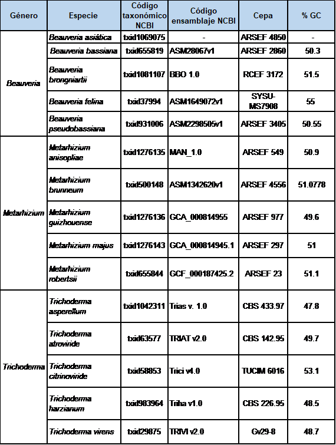
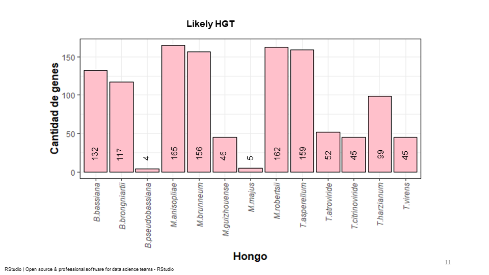

# **METODOLOGÍA**
## **Búsqueda y elección de proteomas de las especies de hongos**
<div style="text-align: justify">
 Para comenzar el análisis, seleccioné tres géneros de hongos endófitos benéficos a trabajar, Beauveria, Metarhizium y Trichoderma. Debido a que existe variedad de especies de dichos géneros, opté por trabajar con cinco especies de cada género. Y de cada una de las especies hice una búsqueda de su correspondiente proteoma en la base de datos NCBI. 

 Para obtener la información necesaria, llevé a cabo una búsqueda en la base de datos pública National Center for Biotechnology Information (NCBI) disponible en:
[https://www.ncbi.nlm.nih.gov/](https://www.ncbi.nlm.nih.gov/ "NCBI")

Y en la siguiente imagen muestro los datos obtenidos.



## **Análisis BLAST**
Para el análisis BLAST, obtuve los proteomas de cada hongo en archivos fasta de NCBI. 
Empleé el clúster *MAZORKA* a través del sistema operativo *UBUBTU*. 

Para ingresar al clúster es necesario contar con una cuenta y contraseña, y acceder mediante *secure-shell* como a ocntinuación se ejemlifica:

```
ssh usuario@123.456.789.0
```
Para trabajar en el análisis me ubiqué en la carpeta de trabajo, donde se encuentra la base de datos para correr el BLAST.

Una vez ubicada la carpeta, procedí a subir los archivos fasta de cada uno de los hongos seleccionados, enseguida ejemplifico como realicé dicho procedimiento para una de las especie.

```
rsync -avP Beauveria_asiatica.fasta znieves@148.247.230.5:/LUSTRE/usuario/znieves/Horiz_tranfer_Fungi
```

Una vez listos los proteomas en el clúster, creé un fichero para cada una de las especies fúngicas con las características para correr el BLAST, como se muestra a continuación:

```
#PBS –N nombre del fichero 
#PBS –l nodes=1:ppn=20,Vmem=50gb,walltime=70:00:00
#PBS –q default

blast –query nombre del archivo fasta del proteoma del hongo –db db_nr_out –evalue 1e-5 –outfmt7 –max_target_seqs 5 –out nombre del hongo.fmt.gzip nombre del hongo.fmt7
```
Una vez listo el fichero de cada uno de los hongos, lo envié a mazorka usando el código: **qsub.nombre del fichero.qsub**

A partir de esto, solo tuve que esperar a que me arrojara los resultados y, una vez terminados los análisis de BLAST, los descargué utilizando una linea de comando como lo ejemplifico a continuación:
```
scp znieves@148.247.230.5:/LUSTRE/usuario/znieves/Horiz_tranfer_Fungi/Trichoderma_virens.fmt7 marisol@marisoll
```
Posteriormente procedí a realizar la identificación de posibles genes de bacterias adquiridos por HGT.

## **Identificación de genes de transferencia horizontal en los proteomas de hongos**
Para llevar a cabo la identificación de los potenciales genes de transferencia horizontal de origen bacteriano en los genomas de hongos, empleé la herramienta bioinformática Alienness disponible en:
[http://alienness.sophia.inra.fr/cgi/index.cgi](http://alienness.sophia.inra.fr/cgi/index.cgi "ALIENNESS")

Para obtener los genes que proceden de una transferencia horizontal, el programa toma en cuenta los siguientes parámetros: datos de entrada, grupo taxonómico de interés, grupos taxonómicos a excluir y grupos taxonómicos potenciales donadores además de esto requiere asignarle un nombre e ingresar un correo electrónico para recibir los resultados. Para esta investigación los datos utilizados fueron: 

- *Datos de entrada*: en este apartado Alienness pide los resultados obtenidos del análisis BLAST
- *Grupo taxonómico de interés*: fungi (4751)
- *Grupos taxonómicos a excluir*: metazoa (33208), viridiplantae (33090), archaea (2157), stramenopiles (33634), alveolata (33630), discoba (2611352), chrysochromulina (35140), leishmania (5658), naegleria (5761), gruberia (37351), plasmodium (418103), viruses (10239), trichomonas vagianlis (5722), planoprotostelium (65007), prymnesiophyceae (2608131), schizotrypanum (47570), sar (2698737), trypanosoma cruzi (5993).
- *Grupos taxonómicos de potenciales donadores*: bacterias (2)

Es importante mencionar que, para ingresar los grupos taxonómicos, Alienness pide que sean ingresados con su código taxonómico, que es posible obtenerlo desde NCBI [https://www.ncbi.nlm.nih.gov>taxonomy](https://www.ncbi.nlm.nih.gov>taxonomy "taxonomy NCBI").

Y a continuación se muestran los resultados que arrojó *Alienness* 


Y se muestra una gráfica del parámetro *likely HGT*:




## **Identificación de proteínas y donadores**
Con los resultados arrojados por Alienness, fue posible identificar la cantidad de genes de cada hongo que son candidatos a venir de una transferencia horizontal, el nombre de dichos genes y consecuentemente saber la función que desempeñan en general, así como también para saber de dónde proviene, es decir la bacteria donadora.

Para esto, dentro de los resultados los únicos datos que tomé en cuenta fueron los clasificados en el parámetro likely HGT, y con el dato query ingresándolo a la biblioteca pública NCBI fue posible obtener toda la información necesaria.

## **Clasificación de hongos por función**
Para realizar este paso, fue necesario conocer la función de todas las proteínas proveniente de una HGT, sin embargo, algunas fueron identificadas como proteínas hipotéticas, y para determinar su función, tomé de los resultados de Alienness el query perteneciente al donador y obtener en NCBI la información que necesitaba de esas proteínas. A pesar de eso, hubo algunas que de igual manera resultaron proteínas hipotéticas, y así se clasificaron.

Una vez sabiendo la información necesaria, la clasifiqué por función de proteínas, para visualizar qué hongos compartían las mismas funciones.

Posterior a tener la clasificación, usando el código query, obtuve de NCBI el fichero fasta de cada una de las proteínas para crear un archivo multifasta por función de proteínas.

## **Filtro de proteínas**

Con los archivos multifasta separados por función, utilicé MAFFT disponible en:
[https://www.ebi.ac.uk/Tools/msa/mafft/](https://www.ebi.ac.uk/Tools/msa/mafft/ "MAFFT") donde ingresé uno a uno los archivos multifasta para que alineara las secuencias de aminoácidos. Y así poder ingresarlas al programa MVIEW [https://www.ebi.ac.uk/Tools/msa/mview/](https://www.ebi.ac.uk/Tools/msa/mview/ "MVIEW") que reformatea los resultados de la alineación y la salida es una alineación apilada con columnas adicionales agregadas para mostrar los números de filas, el porcentaje de cobertura (COV) y el porcentaje de identidad (PID) con respecto a la primera secuencia. Para los fines de esta investigación, se establecieron los parámetros de COV ≥ 90% y PID ≥ 85%, y solo las proteínas que cumplieron con lo establecido los tomé en cuenta, y los representé en un mapa de calor, realizado en el programa RStudio, y a continuación se visualiza.


## **Enriqueciemiento de vías de señalización KEGG**
Una vez que tuve las proteínas a seguir trabajando, creé archivos multifastas en el editor de texto Gedit por cada hongo. Posterior a esto, ingresé al programa bioinformatico en línea BlastKOALA 
[https://www.kegg.jp/blastkoala/](https://www.kegg.jp/blastkoala/ "BLASTKOALA") que realiza asignaciones de KO (ortología KEGG) para caracterizar funciones de genes individuales y reconstruir vías KEGG (Kyoto Encyclopedia of Genes and Genomes).

En BlastKOALA, ingresé los archivos uno a uno para obtener el código KO, y una vez teniéndolo, utilicé el paquete clusterprofiler en el programa RStudio, para obtener las vías en donde interactúan las proteínas de los hongos provenientes de una transferencia horizontal y ver si entre las especies comparten vías. 

Para realizar este proceso, abrí la aplicaion RStudio y tecleé los siguientes comandos, en este caso se ejemplifica para *Beauveria*:

```
getOption("clusterProfiler.download.method")
install.packages("R.utils")
R.utils::setOption("clusterProfiler.download.method","auto")
BiocManager::install("clusterProfiler")
if (!require("BiocManager", quietly = TRUE))
  install.packages("BiocManager")
  BiocManager::install("enrichplot")

library("clusterProfiler") 
library("R.utils")
library("ggplot2")
library("enrichplot")

Beuveria<-c("K00613", "K00130", "K03782", "K21801", "K01425", "K00613", "K00130", "K03782", "K21801", "K06889", "K06889", "K08987", "K06889", "K06889", "K08987", "K00612", "K01481", "K01481", "K01481", "K00612", "K01481", "K22185", "K00467", "K01647", "K22185", "K00467", "K01647", "K03881", "K03881", "K03879", "K03879", "K00799", "K19670", "K00799", "K19670", "K01561", "K01561", "K03817")

enKEGG<-enrichKEGG(Beuveria, organism = 'ko', minGSSize = 1,keyType = "kegg", pvalueCutoff = 1, qvalueCutoff = 1)
enKEGG

enKEGG1<-enrichKEGG(Beuveria, organism = 'ko', minGSSize = 1,keyType = "kegg", pvalueCutoff = 0.05,pAdjustMethod = "BH", qvalueCutoff = 1)
enKEGG1
```

Finalmente seleccioné una de las vías de cada uno de los géneros fúngicos y escudriñé sobre su importancia.  
